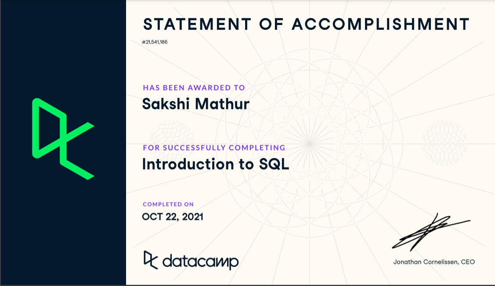

# Week06

Postgres SQL

## what an RDBMS is and what SQL 
RDBMS Relational Database Management System is a database with meaningful related data. Usually organized in tables, data in database can be accessed modified , created or processedthrough defined relations between tables and views. The logical organization of data in tables and meanigful relations between them makes it easier to process data.

SQL Structured Querly Language as name suggests is programming language that helps access RDBMS. Using SQL the data can be created, manipulated, processed, deleted in a RDBMS.

## Week_6_sql_hw explanations

### 1.	Show all customers whose last names start with T. Order them by first name from A-Z.
Uning LIKE filtered the last_name column from customer table and ordered by last_name is ascending order A-Z
selection first_name and last_name to printed as full name under column customers.

### 2.	Show all rentals returned from 5/28/2005 to 6/1/2005
Filtered the return_date column by the dates mentioned in proper sql format yyyy/mm/dd from rental table and printing all columns.

### 3.	How would you determine which movies are rented the most?
Inner join rental and inventory on invenotry id and in turn joining inventory and fim table son film_id. 
Agg count inventory_id as no_of_times_rented from rental and selection film title from film table
grouping by title to get the number of times each movie was rented 
ordering by no_of_times_rented in descending order to list movies most rented to least.

### 4.	Show how much each customer spent on movies (for all time) . Order them from least to most.
inner join payment and customer on customer_id
selecting customer name and id from customer table, aggregation sum amount from payment table to get fetch amount spent by each customer
grouping by films and ordering by sum ampount from least to most

### 5.	Which actor was in the most movies in 2006 (based on this dataset)? Be sure to alias the actor name and count as a more descriptive name. Order the results from most to least.
inner join film_actor and actor table on actor_id
selecting actor name from actor table and count of films from film_actor table
grouping by actor_id and ordering by sum of films is descending order to get the actor list with most movies to least

### 6.	Write an explain plan for 4 and 5. Show the queries and explain what is happening in each one. Use the following link to understand how this works http://postgresguide.com/performance/explain.html 

Used EXPLAIN on queries and commented for each query in sql file with explanations.

### 7.	What is the average rental rate per genre?
joining film and film_category on film_id to get categpry_id for further join
joining film_category and category on category_id to get genres
selecting genre/category from category table and calculating average rental rate form film table.
grouping the results by genre

### 8.	How many films were returned late? Early? On time?
joining rental and inventory on inventory id toget film_id for further join
joining inventory and film on film_id to get rental duration
rental date and return date fetched from rental table
converting rental duration given as integer in film table using INTERVAL function and adding it rental date to get expected_return_date.
using case when to bucket expected_return_date less than retur_date as early
expected_return_date equal to retur_date as on time
expected_return_date more than retur_date as late
as timing
saving this view as exp_return_date
Running another quert to fetch count of inventory_id grouped by timing from view exp_return_date

### 9.	What categories are the most rented and what are their total sales?
join rental and inventory on invenotry_id to get film_id to further join film_category
using category_id to further join with existing view sales_by_film_category on category name
fetching count of rental_id from rental, category name and total sales from the view
grouping by category and total sales and ordering count of rental_id by descending order to get list of most rented movie category to least

### 10.	Create a view for 8 and a view for 9. Be sure to name them appropriately. 
Used CREATE VIEW AS to create view early_ontime_late_returns for #8 and top_category_sales for #9

### Bonus: Write a query that shows how many films were rented each month. Group them by category and month. 
joined rental and inventory on inveotry_id to get film_id to to further join film_category
using category_id further joined category table
extracted month from rental_date column in rental table, calculated count of inventory_id from rental as num_of_films_rented and category name from category 
greouped by moth and category and ordered by month to list how many films were rented each month in each category.

## Introduction to SQL

